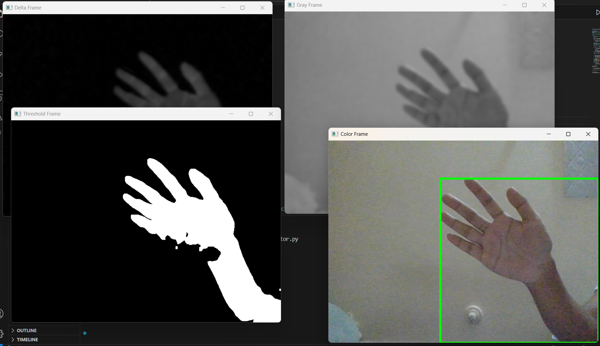

# Motion Detector using Python

## Demo

## Description:
Motion Detector using Python is a simple software application that leverages Python programming language and OpenCV library to detect motion in a video stream. The program captures frames from a connected camera or webcam and analyzes them to identify changes in pixel values over time. When significant changes occur, it classifies them as potential motion and triggers appropriate actions, such as displaying motion alerts, saving video clips, or executing custom responses.

## Features:

Real-time Motion Detection: The Python script continuously monitors the video feed and detects motion in real-time.
Adjustable Sensitivity: Users can tweak the sensitivity level of motion detection to suit their requirements.
Region of Interest (ROI): Specify a specific area within the camera's view to focus the motion detection on that region only.
Motion Alerts: The application can display real-time motion alerts on the video stream or pop-up windows.
Video Recording: Optionally, the script can save video clips when motion is detected for later review.
Prerequisites:

Python 3.x installed on your system.
OpenCV library (install using pip install opencv-python).
## Usage:

Clone or download the Motion Detector repository from https://github.com/nitinsingh0219/motion-dector.git
Ensure you have Python 3.x and OpenCV installed.
Adjust the configuration parameters in the script, such as sensitivity, ROI coordinates, or actions to be triggered on motion detection.
Run the script using the command: python motion_detector.py.
Configuration:
Open the motion_detector.py script in a text editor to modify the following parameters:

### SENSITIVITY: Adjust the sensitivity level (lower values for higher sensitivity, and vice versa).
ROI_COORDINATES: Set the Region of Interest (ROI) by specifying the top-left and bottom-right coordinates of the rectangular area to monitor.
ALERT_METHOD: Choose the method of displaying motion alerts (e.g., 'visual', 'popup', etc.).
RECORD_VIDEO: Set to True if you want to save video clips on motion detection; set to False otherwise.
### Troubleshooting:

If the camera is not recognized, ensure you have the correct camera drivers installed and the camera is connected properly.
In case of false positives, adjust the sensitivity level or refine the ROI to avoid unnecessary triggers.
Check the terminal or console output for any error messages.
### Contributing:
Motion Detector using Python is an open-source project, and contributions are welcome. If you encounter any issues or have suggestions for improvements, feel free to submit bug reports or pull requests to the project repository on GitHub.

## Disclaimer:

Motion Detector using Python is a tool for general-purpose motion detection. It may not be suitable for critical security applications or environments requiring high precision and reliability.
The developers are not responsible for any damages or issues arising from the use of this software.

Contact:
For any inquiries or support, you can contact the development team at nitinsingh9155@gmail.com.
